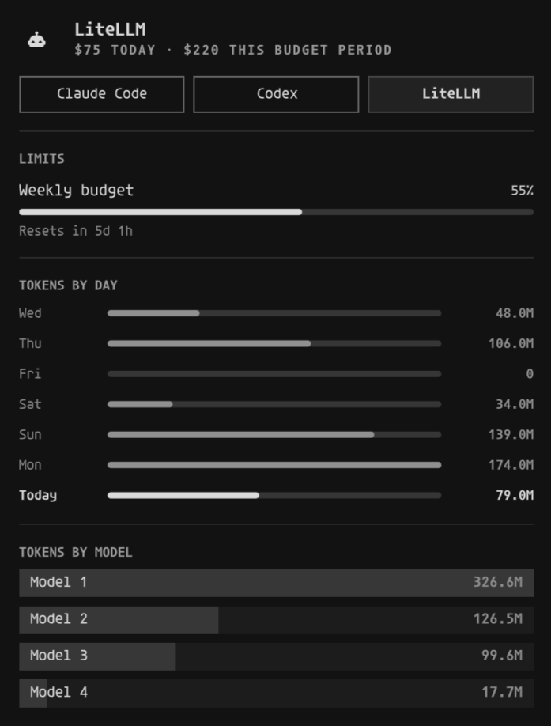

# LiteLLM Usage for Omarchy

LiteLLM usage in Omarchy’s native **Agents panel**:

- Today’s spend and spend in the current budget period
- User budget meter with reset countdown
- Seven-day token history and model breakdown
- Automatic refresh every five minutes



Requires Omarchy’s native Agents panel, Python 3.10+, and a LiteLLM virtual key
with permission to read usage. Budget information is shown when available.

## Install

```sh
omarchy plugin add https://github.com/reinno/omarchy-litellm-usage.git
```

## Configure

Create `~/.config/omarchy/agents/litellm.json`:

```json
{
  "url": "https://litellm.example.com",
  "tokenFile": "~/.config/omarchy/agents/litellm.token",
  "privacyMode": true,
  "refreshIntervalSec": 300
}
```

Save your virtual key in the token file and restrict access:

```sh
mkdir -p ~/.config/omarchy/agents
(umask 077; printf %s "$LITELLM_TOKEN" > ~/.config/omarchy/agents/litellm.token)
chmod 600 ~/.config/omarchy/agents/litellm.token
```

This command uses your existing `LITELLM_TOKEN` environment variable. If it is
not set, put your virtual key in the file using your editor.

Then enable the plugin:

```sh
omarchy plugin enable reinno.litellm-usage
```

Open **Agents → LiteLLM**. Configuration stays outside the plugin and survives updates.

Alternatively, use `LITELLM_URL` and `LITELLM_TOKEN` from the desktop session.
Variables set only in a terminal’s `.zshrc` are not available to the desktop shell.
Set `tokenEnv` in the config to use a different token variable.

Today’s spend is for the current key; budget-period spend covers the user’s
budget across keys. Daily charts use UTC dates.

Set `privacyMode` to `true` to replace model IDs with `Model 1`, `Model 2`, …
and round spend and token counts to useful approximate values. This keeps the
panel informative without writing exact model or billing details to the local
usage record. Budget percentages are still shown approximately.

## Update and refresh

```sh
omarchy plugin update reinno.litellm-usage --yes
omarchy-shell reinno.litellm-usage refresh
omarchy-shell reinno.litellm-usage status
```

## Remove

```sh
omarchy plugin disable reinno.litellm-usage
python3 ~/.config/omarchy/plugins/reinno.litellm-usage/collector.py --remove-record
omarchy-shell omarchy.agents refresh
omarchy plugin remove reinno.litellm-usage --yes
```

Your configuration and token file are kept.

[Development and technical notes](DEVELOPMENT.md) · [MIT License](LICENSE)
